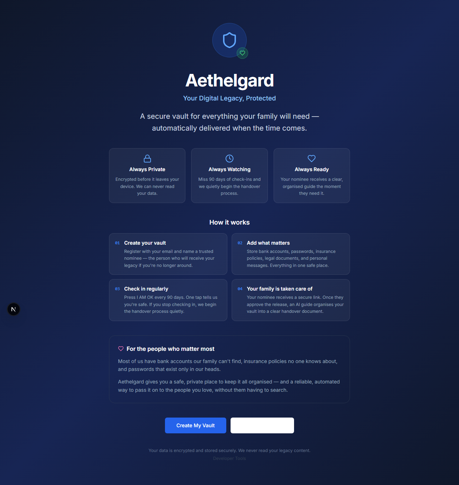
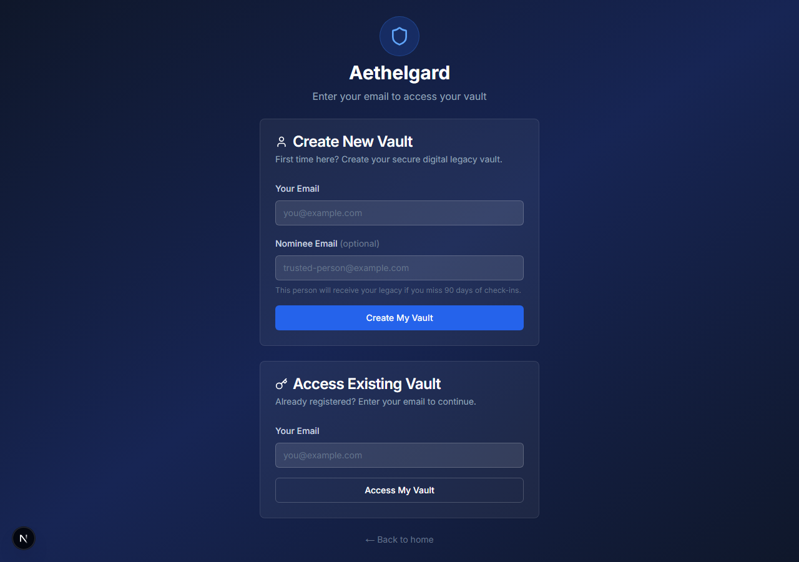
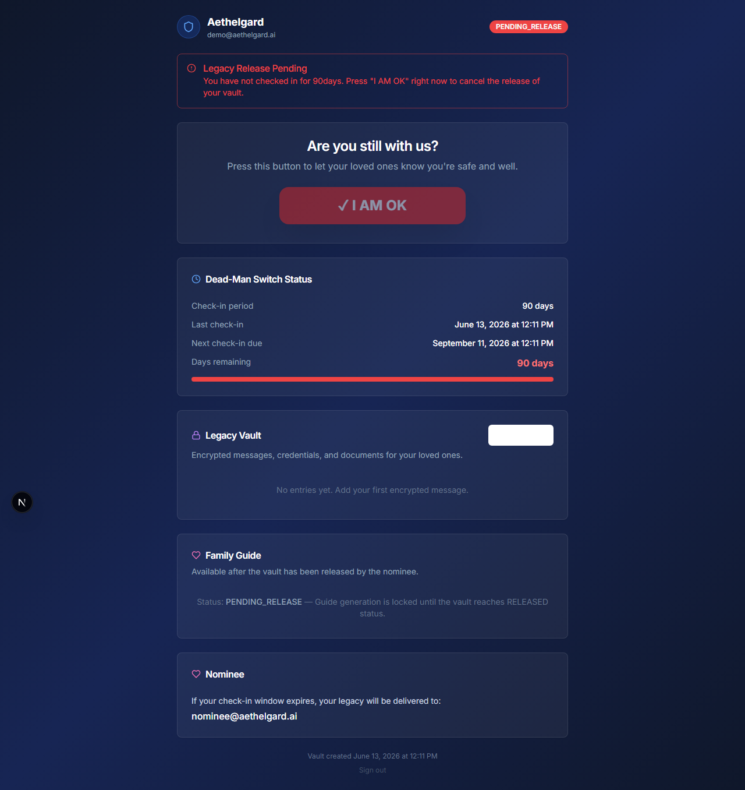
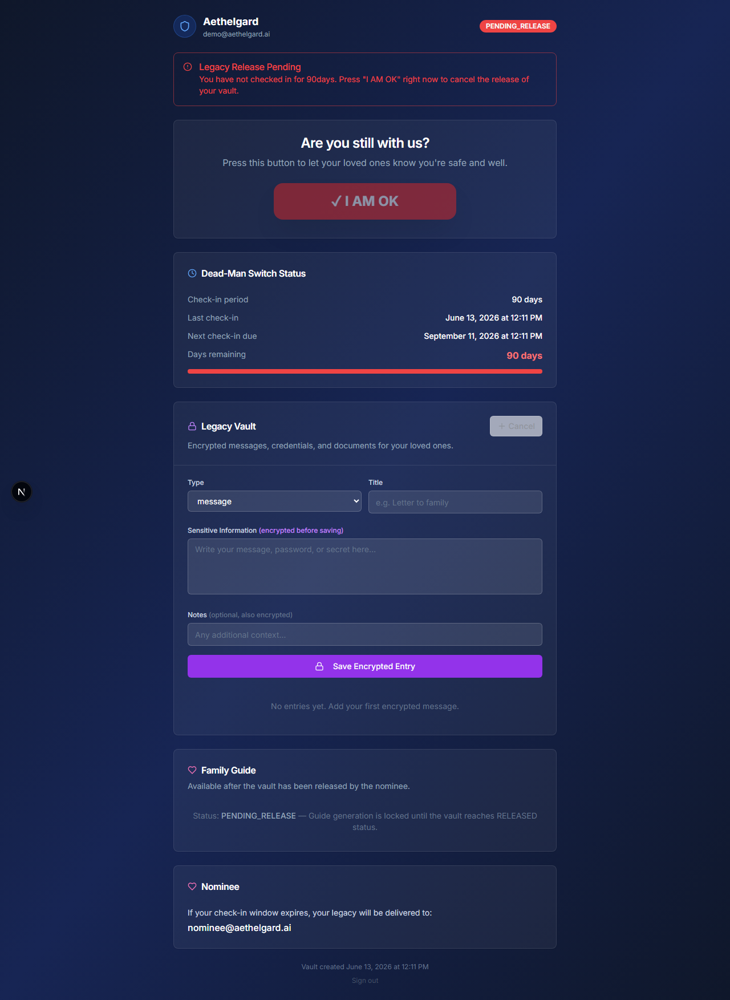
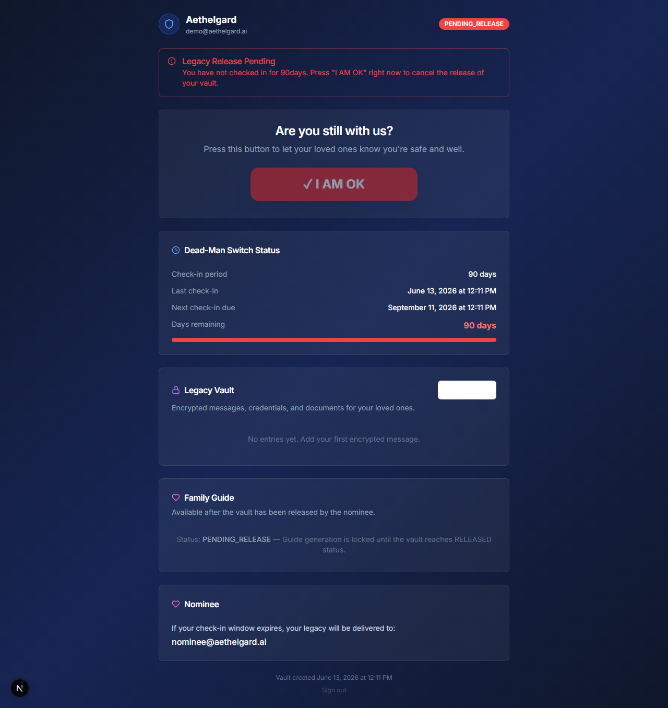
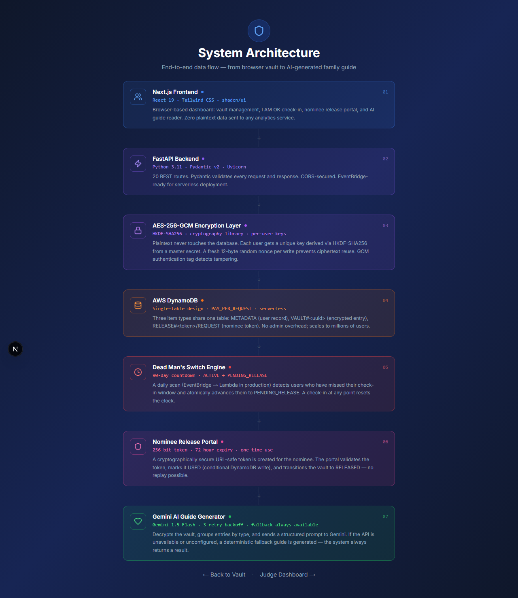

# Aethelgard

**Secure Digital Legacy Vault with Automated Inactivity Detection**

Aethelgard gives people a private, encrypted place to store critical account information, legal documents, and personal messages — and automatically delivers that vault to a trusted nominee when the owner stops checking in.

---

## Overview

Most people accumulate dozens of critical digital accounts over their lifetime: bank accounts, insurance policies, crypto wallets, subscription services, and personal correspondence. When someone dies or becomes incapacitated unexpectedly, their family has no reliable way to find or access these assets.

Aethelgard solves this with three components working together:

1. **An encrypted vault** — sensitive information is encrypted client-side before it ever reaches the database.
2. **An inactivity monitor (Dead Man's Switch)** — if the owner stops checking in for a configurable period (default: 90 days), the system automatically begins the release process.
3. **A nominee release portal** — the owner designates a trusted person who receives a one-time, time-limited link to approve the vault release and receive an AI-generated family guide.

---

## Problem Statement

The average person now holds 100+ online accounts. Without deliberate planning:

- Bank accounts and investment holdings go unclaimed for years.
- Life insurance payouts are missed because beneficiaries don't know a policy exists.
- Crypto wallets become permanently inaccessible.
- Subscription services continue billing the estate.

Estate planning tools exist for physical assets and legal documents, but no automated, privacy-preserving solution exists for the full scope of a person's digital footprint.

---

## Solution

Aethelgard is an open-source digital legacy platform with:

- **Encrypted vault storage** — AES-256-GCM encryption with per-user HKDF-SHA256 key derivation. Plaintext is never stored or logged.
- **Configurable inactivity detection** — a periodic scan transitions vaults from `ACTIVE` to `PENDING_RELEASE` after a missed check-in window.
- **Nominee approval workflow** — a 256-bit URL-safe release token is generated and (in production) emailed to the nominee. One-time use, 72-hour expiry.
- **AI-curated handover guide** — after vault release, Gemini 1.5 Flash generates a structured, human-readable family guide from the decrypted vault contents. A deterministic fallback always works if the AI is unavailable.

---

## Key Features

### Secure Vault

Store credentials, documents, notes, and personal messages. Each entry is encrypted individually with a fresh random nonce before any DynamoDB write. The list endpoint returns only titles and metadata — sensitive fields are never exposed in bulk.

### Encryption Layer

AES-256-GCM encryption with HKDF-SHA256 per-user key derivation from a master secret. Each user gets a unique 256-bit AES key. The production path uses AWS KMS envelope encryption (implementation stub included). See [Security Model](#security-model) for the full design.

### Dead Man's Switch

The owner checks in periodically (default: every 90 days) via a single API call or UI button. A background scan — scheduled daily via AWS EventBridge in production — detects overdue users and transitions their vault to `PENDING_RELEASE`. A check-in at any point, including from `PENDING_RELEASE`, immediately resets status to `ACTIVE`.

```
ACTIVE
  │  (90 days without check-in)
  ▼
PENDING_RELEASE  ◀──── check-in resets to ACTIVE
  │  nominee release token created
  ▼
Nominee visits /release/{token}
  │  POST /release/{token}/approve
  ▼
RELEASED
```

### Nominee Release Portal

A 256-bit URL-safe release token is generated when the vault enters `PENDING_RELEASE`. The nominee visits a dedicated portal at `/release/{token}`, reviews the request, and approves the release. Tokens are single-use, expire after 72 hours, and are invalidated via a conditional DynamoDB write.

### AI Family Guide Generator

Once a vault is `RELEASED`, `POST /users/{email}/family-guide` decrypts all entries, groups them by type, and sends a structured prompt to Gemini 1.5 Flash. The guide is formatted for non-technical family members.

**Fallback mode:** when `GEMINI_API_KEY` is not set or the API is unreachable, a fully deterministic structured guide is generated automatically. The endpoint always returns a result.

### Audit-Friendly Architecture

- Single-table DynamoDB design with explicit PK/SK patterns — every access pattern is a key lookup or bounded query.
- 168 automated tests covering every route and service function (pytest + moto, no real AWS required).
- Plaintext never appears in logs, list endpoints, or any response except the explicit single-entry GET and the family guide endpoint.

---

## Architecture

```
┌─────────────────────────────────────────────────────┐
│  Browser  (Next.js 15 + React 19 + TypeScript)       │
│  shadcn/ui · Tailwind CSS                            │
└──────────────────────┬──────────────────────────────┘
                       │ HTTPS REST (JSON)
                       ▼
┌─────────────────────────────────────────────────────┐
│  FastAPI Backend  (Python 3.11 + Pydantic v2)        │
│                                                      │
│  ┌─────────────────┐   ┌──────────────────────────┐ │
│  │ Vault API        │   │ Dead Man's Switch Engine  │ │
│  │ /users/*         │   │ scan_dead_man_switch()    │ │
│  │ /release/*       │   │ → EventBridge (prod)      │ │
│  └────────┬─────────┘   └─────────────┬────────────┘ │
│           │                           │              │
│  ┌────────▼───────────────────────────▼────────────┐ │
│  │ AES-256-GCM Encryption Layer                     │ │
│  │ HKDF-SHA256 per-user key  ·  fresh nonce/write   │ │
│  │ ENCRYPTION_MODE=local (dev)  |  kms (prod)       │ │
│  └────────────────────┬─────────────────────────────┘ │
└───────────────────────┼─────────────────────────────┘
                        │ boto3
                        ▼
┌─────────────────────────────────────────────────────┐
│  AWS DynamoDB  (single-table: Aethelgard_Vault)      │
│                                                      │
│  PK                  SK            Item type         │
│  USER#<email>        METADATA      User + status     │
│  USER#<email>        VAULT#<uuid>  Encrypted entry   │
│  RELEASE#<token>     REQUEST       Nominee token     │
└─────────────────────────────────────────────────────┘
                        │ (RELEASED status)
                        ▼
┌─────────────────────────────────────────────────────┐
│  AI Family Guide                                     │
│  Gemini 1.5 Flash  ──(unavailable)──▶  Fallback     │
│  Always returns a structured result                  │
└─────────────────────────────────────────────────────┘
```

---

## Security Model

### Vault Encryption

Vault entries are encrypted with **AES-256-GCM** before any DynamoDB write. The GCM authentication tag (16 bytes, appended to ciphertext) detects tampering — any modification causes decryption to raise `InvalidTag`.

Each user gets a unique 256-bit AES key derived via **HKDF-SHA256** from a master secret and the user's email address:

```
LOCAL_MASTER_KEY  ──HKDF(SHA-256, info=email)──▶  per-user 256-bit key
                                                        │
                                  fresh 96-bit nonce ───┤
                                                        ▼
                                                  AES-256-GCM
                                                        │
                                                        ▼
                                           ciphertext ‖ auth_tag
```

Compromising one user's key reveals nothing about any other user's data.

In production, `ENCRYPTION_MODE=kms` calls `kms:GenerateDataKey` for a fresh data key per write. The KMS-encrypted data key is stored alongside the ciphertext (standard envelope encryption). Implementation stub in `backend/app/security/encryption.py`.

### No-Plaintext Guarantee

- `sensitive_data` and `notes` are encrypted before any DynamoDB call.
- `GET /users/{email}/vault` (list) returns only titles, types, and timestamps — never sensitive content.
- Decryption only occurs in `GET /users/{email}/vault/{entry_id}` and `POST /users/{email}/family-guide`.
- Master key and data keys are never logged or persisted by the application.

### Release Gating

The family guide endpoint (`POST /users/{email}/family-guide`) checks `status === RELEASED` before decrypting. Any other status returns HTTP 403. This cannot be bypassed without a database write.

### Inactivity Detection

The Dead Man's Switch scan uses a conditional DynamoDB write:

```python
ConditionExpression="attribute_exists(PK) AND #s = :active"
```

This prevents double-transitions if the scan runs concurrently or crashes mid-run. Users already in `PENDING_RELEASE` or `RELEASED` are skipped automatically.

### Nominee Token Security

- 256-bit URL-safe token (`secrets.token_urlsafe(32)`).
- One-time use enforced by a conditional write that fails if `token_status != PENDING`.
- 72-hour expiry checked at validation time; expired tokens return `valid: false` rather than 404, so the portal can display the reason.

### Current Production Blockers

These items must be resolved before handling real user data:

| # | Blocker | Impact |
|---|---------|--------|
| 1 | **Authentication not implemented** | Any caller who knows a user's email can read, write, or delete their vault entries. Add JWT or AWS Cognito middleware to all `/users/*`, `/vault/*`, and `/release/*` routes. |
| 2 | **AWS KMS not implemented** | `ENCRYPTION_MODE=kms` raises `NotImplementedError`. Run `ENCRYPTION_MODE=local` for development only. |
| 3 | **Nominee email delivery not wired up** | `create_release_request()` generates a token but does not send it to the nominee. Integrate AWS SES or SendGrid before production. |
| 4 | **Admin endpoints unprotected** | `/admin/*` routes have no access control. Add `X-Admin-Secret` header check or deploy behind a VPC before production. |
| 5 | **HTTPS and CORS not hardened** | Backend CORS allows `localhost`. Restrict to your production domain and enforce HTTPS at the load balancer. |
| 6 | **Atomic release transition not implemented** | `approve_release()` performs two sequential DynamoDB writes. A crash between them leaves the token consumed and the vault unreleased. Replace with `TransactWriteItems`. |
| 7 | **Legal review pending** | Storing wills, beneficiary designations, and estate instructions may trigger legal obligations. Consult a qualified lawyer before accepting real estate documents. |

To audit all hardening TODOs in the codebase:

```bash
grep -rn "TODO (before production)" backend/
```

---

## Tech Stack

| Layer | Technology |
|-------|-----------|
| **Frontend** | Next.js 15, React 19, TypeScript 5 |
| **UI** | Tailwind CSS, shadcn/ui (Radix UI primitives) |
| **Backend** | Python 3.11, FastAPI, Uvicorn, Pydantic v2 |
| **Database** | AWS DynamoDB — single-table design, PAY_PER_REQUEST |
| **Encryption** | Python `cryptography` library — AES-256-GCM, HKDF-SHA256 |
| **AI** | Google Gemini 1.5 Flash via `google-generativeai` SDK |
| **Testing** | pytest, moto (`mock_aws`) — 168 tests, no real AWS required |
| **Infrastructure** | AWS DynamoDB, AWS KMS (planned), AWS SES (planned), AWS EventBridge + Lambda (planned) |

---

## Local Development

### Prerequisites

- Node.js 18+
- Python 3.11+
- No AWS account required for local development (moto provides a local DynamoDB mock)

### 1. Backend

```bash
cd backend

# Create and activate virtual environment
python -m venv .venv
.venv\Scripts\activate        # Windows
# source .venv/bin/activate   # macOS / Linux

# Install dependencies
pip install -r requirements.txt

# Copy and configure environment
cp .env.example .env
# Edit .env:
#   LOCAL_MASTER_KEY — generate with: python -c "import secrets; print(secrets.token_hex(32))"
#   All other defaults work for local development
```

### 2. Start the local DynamoDB mock

Aethelgard uses [moto](https://github.com/getmoto/moto) as an in-process DynamoDB mock for tests. For the running server, start the moto HTTP server (already installed with the dev dependencies):

```bash
# From the backend/ directory, in a dedicated terminal
pip install flask flask-cors   # one-time only
python -m moto.server -p 5001
```

Then confirm `backend/.env` has:

```env
DYNAMODB_ENDPOINT_URL=http://localhost:5001
AWS_ACCESS_KEY_ID=local-dev-key
AWS_SECRET_ACCESS_KEY=local-dev-secret
```

Alternatively, use a real AWS account: leave `DYNAMODB_ENDPOINT_URL` blank and set real `AWS_ACCESS_KEY_ID` / `AWS_SECRET_ACCESS_KEY`.

### 3. Start the backend

```bash
# From backend/ directory
uvicorn app.main:app --reload --port 8000
# → http://localhost:8000
# → Interactive API docs: http://localhost:8000/docs
```

### 4. Initialize the DynamoDB table

```bash
curl -X POST http://localhost:8000/admin/init-db
# → {"created": true, "table_name": "Aethelgard_Vault"}
```

> This is a one-time step per moto server session. The table is lost when the moto server restarts.

### 5. Frontend

```bash
# From the project root
npm install
cp .env.example .env.local
# NEXT_PUBLIC_API_BASE_URL=http://localhost:8000 (already set in .env.example)

npm run dev
# → http://localhost:3000
```

### 6. Run tests

```bash
cd backend
pytest tests/ -v
# → 168 passed (moto in-process mock, no real AWS or moto server needed)
```

### Environment Variables Reference

**Backend (`backend/.env`)**

| Variable | Required | Default | Description |
|----------|----------|---------|-------------|
| `AWS_REGION` | Yes | `us-east-1` | AWS region |
| `AWS_ACCESS_KEY_ID` | Yes | — | Any non-empty value for local dev |
| `AWS_SECRET_ACCESS_KEY` | Yes | — | Any non-empty value for local dev |
| `DYNAMODB_TABLE_NAME` | Yes | `Aethelgard_Vault` | DynamoDB table name |
| `DYNAMODB_ENDPOINT_URL` | No | _(blank = real AWS)_ | Local mock endpoint |
| `ENCRYPTION_MODE` | Yes | `local` | `local` (dev) or `kms` (prod) |
| `LOCAL_MASTER_KEY` | Yes (local mode) | — | 64-char hex string |
| `KMS_KEY_ID` | Yes (kms mode) | — | AWS KMS key ARN or alias |
| `DEAD_MAN_SWITCH_DAYS` | No | `90` | Inactivity threshold in days |
| `RELEASE_TOKEN_EXPIRY_HOURS` | No | `72` | Nominee token validity window |
| `GEMINI_API_KEY` | No | — | AI guide generation (fallback used if unset) |

**Frontend (`.env.local`)**

| Variable | Required | Default | Description |
|----------|----------|---------|-------------|
| `NEXT_PUBLIC_API_BASE_URL` | Yes | `http://localhost:8000` | FastAPI backend URL |

---

## API Reference

### System

| Method | Path | Description |
|--------|------|-------------|
| `GET` | `/health` | Health check — returns service name and environment |

### Admin

| Method | Path | Description |
|--------|------|-------------|
| `POST` | `/admin/init-db` | Create DynamoDB table if not exists |
| `GET` | `/admin/deadman/scan` | Run inactivity scan (ACTIVE → PENDING_RELEASE) |
| `GET` | `/admin/deadman/overdue` | List ACTIVE users whose check-in window has elapsed |
| `POST` | `/admin/release/{email}` | Generate nominee release token for a PENDING_RELEASE user |

> **Note:** Admin routes have no authentication in the current build. Protect them before exposing to the internet.

### Users

| Method | Path | Description |
|--------|------|-------------|
| `POST` | `/users` | Register a new vault (creates user + initialises DMS) |
| `GET` | `/users/{email}` | Get user metadata and vault status |
| `POST` | `/users/{email}/check-in` | Record a check-in — resets inactivity countdown to ACTIVE |

### Vault

| Method | Path | Description |
|--------|------|-------------|
| `POST` | `/users/{email}/vault` | Create an encrypted vault entry |
| `GET` | `/users/{email}/vault` | List vault entries (metadata only — no sensitive fields) |
| `GET` | `/users/{email}/vault/{entry_id}` | Get and decrypt a single entry |
| `DELETE` | `/users/{email}/vault/{entry_id}` | Delete a vault entry |

### Release Portal

| Method | Path | Description |
|--------|------|-------------|
| `GET` | `/release/{token}` | Validate a nominee release token (no state change) |
| `POST` | `/release/{token}/approve` | Approve release — transitions vault to RELEASED, invalidates token |

### Family Guide

| Method | Path | Description |
|--------|------|-------------|
| `POST` | `/users/{email}/family-guide` | Generate AI family guide (requires RELEASED status) |
| `GET` | `/users/{email}/family-guide/demo` | Sample guide with no release gate (development preview) |

---

## Testing

The test suite uses [moto](https://github.com/getmoto/moto)'s `mock_aws()` decorator to provide an in-process DynamoDB mock. No real AWS credentials or network access are required.

```bash
cd backend
pytest tests/ -v
```

```
168 passed in ~36s

test_health.py         5 tests  — health, docs, OpenAPI routes
test_users.py         11 tests  — registration, check-in, duplicates, validation
test_encryption.py    18 tests  — AES-256-GCM round-trips, HKDF key derivation
test_vault.py         18 tests  — encrypted CRUD, no-plaintext guarantee, nonce uniqueness
test_deadman.py       22 tests  — scan engine, overdue detection, idempotency, status reset
test_release.py       35 tests  — token create/validate/approve/expire, all HTTP status codes
test_family_guide.py  31 tests  — Gemini path, fallback, release gate, demo endpoint
test_demo.py          18 tests  — seed setup, idempotency, stats endpoint
```

---

## DynamoDB Table Design

Table: `Aethelgard_Vault` — single-table design, PAY_PER_REQUEST billing.

| PK | SK | Item type | Contents |
|----|----|-----------|----------|
| `USER#<email>` | `METADATA` | User record | Email, nominee, status, check-in timestamps |
| `USER#<email>` | `VAULT#<uuid>` | Encrypted vault entry | AES-256-GCM ciphertext, nonce, entry type, title |
| `RELEASE#<token>` | `REQUEST` | Nominee release token | Owner email, expiry, status (PENDING/USED/EXPIRED) |

All reads are single-key lookups or bounded `query()` calls on the partition key. No global secondary indexes are currently required at this scale.

---

## Project Status

**Functional MVP — core features complete, not yet production-hardened.**

| Component | Status |
|-----------|--------|
| Encrypted vault CRUD | Complete |
| Dead Man's Switch engine | Complete |
| Nominee release portal | Complete |
| AI Family Guide (Gemini + fallback) | Complete |
| Next.js frontend | Complete |
| Authentication | Not started |
| AWS KMS envelope encryption | Stub only |
| Nominee email delivery | Not started |
| EventBridge + Lambda scheduling | Documented, not deployed |
| Atomic release transition | Not started |

See `DEPLOYMENT_CHECKLIST.md` for the full production deployment guide.

---

## Roadmap

### Phase 1 — MVP (Complete)

- [x] AES-256-GCM vault encryption with HKDF-SHA256 key derivation
- [x] Dead Man's Switch engine — configurable inactivity threshold
- [x] Nominee release portal — 256-bit token, one-time use, 72h expiry
- [x] Gemini AI family guide with deterministic fallback
- [x] Next.js frontend — vault, check-in, release portal, family guide
- [x] 168-test suite with moto DynamoDB mock

### Phase 2 — Production Security

- [ ] JWT authentication (AWS Cognito or self-hosted)
- [ ] AWS KMS envelope encryption (`kms:GenerateDataKey`)
- [ ] Admin endpoint protection (`X-Admin-Secret` header or VPC restriction)
- [ ] HTTPS enforcement + CORS hardening
- [ ] Atomic release transition (`TransactWriteItems`)
- [ ] Rate limiting on check-in and vault endpoints

### Phase 3 — Automated Release Infrastructure

- [ ] AWS SES / SendGrid nominee email delivery
- [ ] EventBridge + Lambda for daily Dead Man's Switch scan
- [ ] Nominee identity verification before release
- [ ] Webhook support for external integrations

### Phase 4 — Extended Vault

- [ ] File and media vault (S3)
- [ ] Multi-nominee support with per-entry access control
- [ ] Vault sharing with time-limited read tokens
- [ ] Audit log for all vault access events
- [ ] GDPR / data deletion request workflow

---

## Screenshots

### Landing Page


### Create Vault


### Dashboard


### Legacy Vault Entry


### Family Guide


### Architecture

